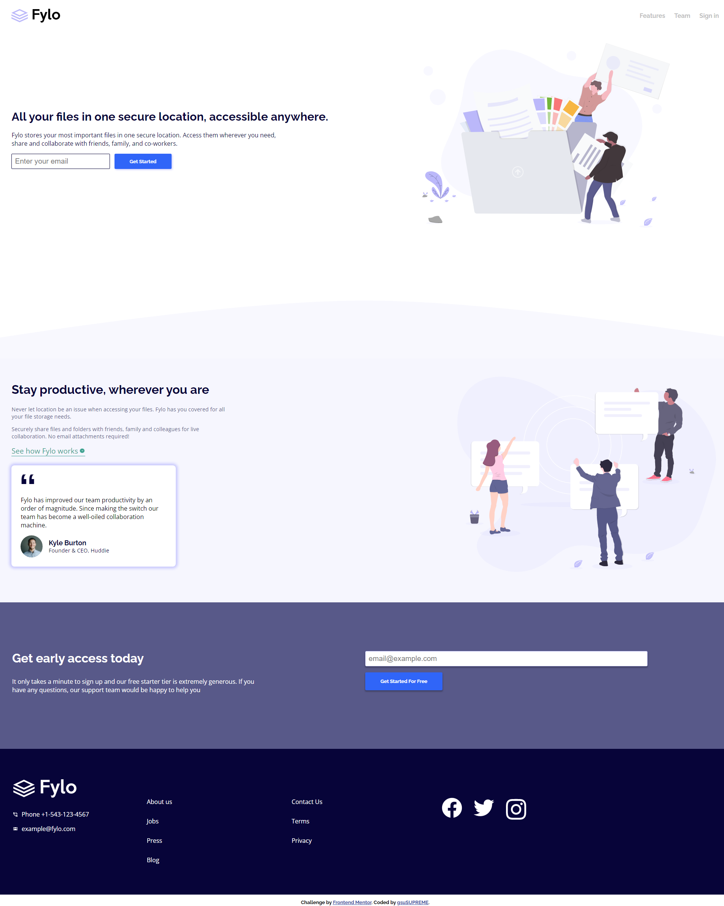

# Frontend Mentor - Fylo landing page with two column layout solution

This is a solution to the [Fylo landing page with two column layout challenge on Frontend Mentor](https://www.frontendmentor.io/challenges/fylo-landing-page-with-two-column-layout-5ca5ef041e82137ec91a50f5). Frontend Mentor challenges help you improve your coding skills by building realistic projects. 

## Table of contents

- [Overview](#overview)
  - [The challenge](#the-challenge)
  - [Screenshot](#screenshot)
  - [Links](#links)
- [My process](#my-process)
  - [Built with](#built-with)
  - [What I learned](#what-i-learned)
- [Author](#author)

## Overview

### The challenge

Users should be able to:

- View the optimal layout for the site depending on their device's screen size
- See hover states for all interactive elements on the page

### Screenshot

### Links

- Solution URL: [https://github.com/gsuSUPREME/fylo-landing-page](https://github.com/gsuSUPREME/fylo-landing-page)
- Live Site URL: [http://fylo-landing-page-ecru.vercel.app/](http://fylo-landing-page-ecru.vercel.app/)

## My process

### Built with

- Semantic HTML5 markup
- CSS custom properties
- Flexbox
- Mobile-first workflow
- [Svelte](https://svelte.dev/) - JS library
- [Vite](https://vitejs.dev/) - Powerful Build Tool

### What I learned

I learned the basics of svelte in the entire process.

## Author

- Website - [https://gsusupreme.github.io/portfolio-xd/](https://gsusupreme.github.io/portfolio-xd/)
- Frontend Mentor - [@gsuSUPREME](https://www.frontendmentor.io/profile/gsuSUPREME)
- Whatsapp - [+58-424-625-0126](https://wa.link/4eyndv)

**Note: Delete this note and add/remove/edit lines above based on what links you'd like to share.**

